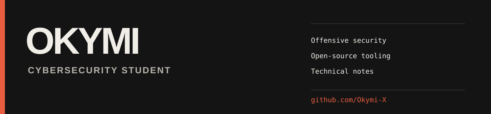
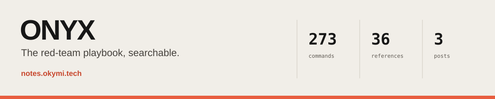

[Onyx](https://notes.okymi.tech/) / [LinkedIn](https://www.linkedin.com/in/ali-mahamat-nour-youssouf/) / [htb-terminal](https://github.com/Okymi-X/htb-terminal) / [arsenal](https://github.com/Okymi-X/arsenal)

I am a cybersecurity student focused on offensive security, Active Directory, and automation. I turn lab experience into useful tools and searchable technical references.

## Selected work

### [Onyx](https://notes.okymi.tech/)

A searchable red-team knowledge base for verified commands, Active Directory attack chains, and hands-on write-ups.

### [htb-terminal](https://github.com/Okymi-X/htb-terminal)

A zero-dependency Python CLI for the Hack The Box Labs v4 API, including machines, VPN switching, and raw API access.

### [arsenal](https://github.com/Okymi-X/arsenal)

A Go package and environment manager for offensive-security tooling with isolated versions and PATH shims.

## Credentials

**Practical labs**

- [Hack The Box Pro Labs: Zephyr](https://www.linkedin.com/in/ali-mahamat-nour-youssouf/details/certifications/) - August 2026
- [Hack The Box Pro Labs: Dante](https://www.linkedin.com/in/ali-mahamat-nour-youssouf/details/certifications/) - May 2026

## Current focus

Offensive-security tooling, Active Directory and Kerberos, security-focused APIs and CLIs, and clear technical documentation.

## Principles

Build for real operator problems. Keep automation reproducible. Document the reasoning. Practice only in authorized environments.
