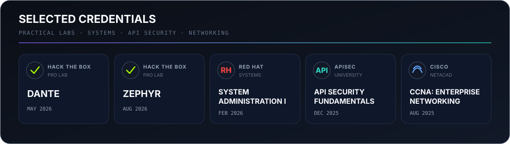

  

  <a href="https://notes.okymi.tech/">Onyx Knowledge Base</a> ·
  <a href="https://www.linkedin.com/in/ali-mahamat-nour-youssouf/">LinkedIn</a> ·
  <a href="https://github.com/Okymi-X/htb-terminal">htb-terminal</a> ·
  <a href="https://github.com/Okymi-X/arsenal">arsenal</a>

I am a cybersecurity student focused on offensive security, Active Directory, and security automation. I turn lab experience into reliable tools and searchable technical references.

## Selected work

| Project | What it does | Built with |
| --- | --- | --- |
| [Onyx](https://notes.okymi.tech/) | Searchable red-team knowledge base for verified commands, AD and AD CS attack chains, and hands-on write-ups. | TypeScript, React, security research |
| [htb-terminal](https://github.com/Okymi-X/htb-terminal) | Zero-dependency CLI for the Hack The Box Labs v4 API: machines, VPN switching, and raw API access. | Python |
| [arsenal](https://github.com/Okymi-X/arsenal) | Domain-aware package and environment manager for offensive-security tooling with isolated versions and PATH shims. | Go |

## Credentials

Verified on [LinkedIn](https://www.linkedin.com/in/ali-mahamat-nour-youssouf/details/certifications/). Additional coursework includes CCNA Switching, Routing and Wireless Essentials; CCNA Introduction to Networks; and Introduction to Cybersecurity.

## Current focus

- Offensive-security tooling and repeatable lab workflows
- Active Directory, Kerberos, and AD CS security
- Security-focused API and CLI engineering
- Clear, searchable technical documentation

## Working principles

Build for real operator problems. Keep automation reproducible. Document the reasoning. Practice only in authorized environments.
