# Okymi

Cybersecurity student focused on offensive security, security automation, and open-source engineering.

I build tools that make security workflows more reliable and repeatable. My current work spans Python, Go, TypeScript, Linux, APIs, Active Directory, and CI/CD.

## Selected work

- [htb-terminal](https://github.com/Okymi-X/htb-terminal) — Zero-dependency Python CLI for the Hack The Box Labs v4 API, including machine management, VPN switching, and raw API access.
- [arsenal](https://github.com/Okymi-X/arsenal) — Go-based package and environment manager for offensive-security tooling, with version isolation and PATH shims.

## Current focus

- Offensive security tooling and repeatable lab workflows
- Active Directory and Kerberos security
- Security-focused API and CLI engineering
- AI-assisted automation for engineering and research

## Technologies

`Python` · `Go` · `TypeScript` · `Linux` · `Git` · `Docker` · `REST APIs` · `CI/CD`

## Engineering principles

- Build small, reliable tools that solve real operator problems.
- Document behavior clearly and keep automation reproducible.
- Practice security only in authorized labs and environments.
